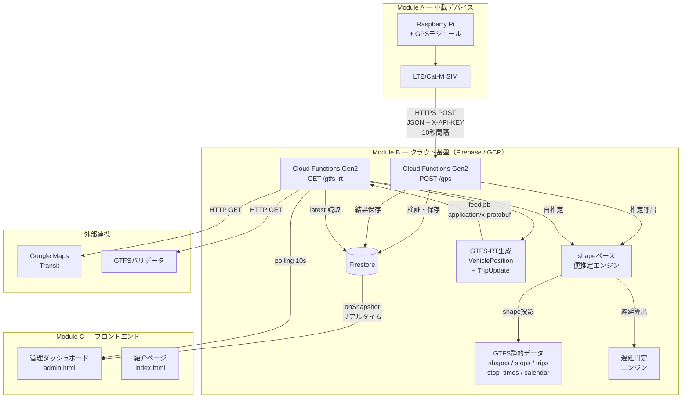
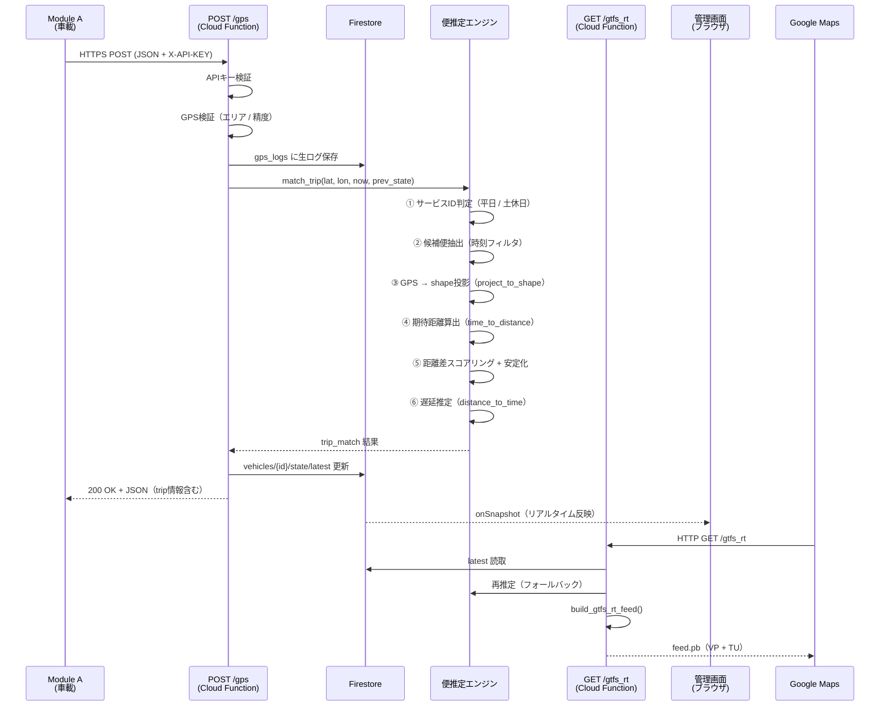
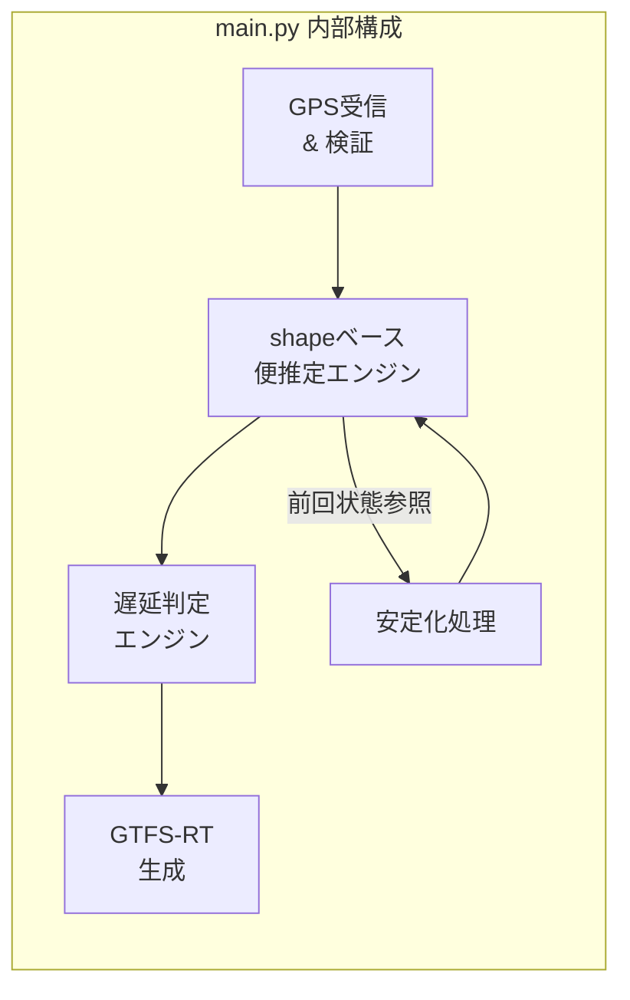
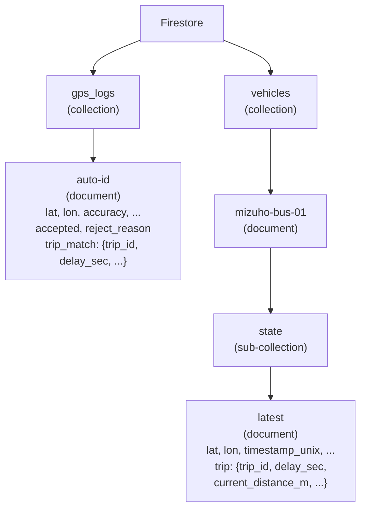
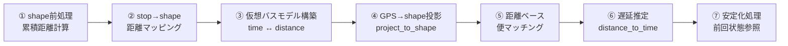

# 瑞穂町コミュニティバス バスロケーションシステム（PoC）
# システム設計書

**Mizuho Bus Location PoC — System Design Document**

| 項目 | 内容 |
|:---|:---|
| バージョン | 2.0 |
| 作成日 | 2026/04/04 |
| プロジェクト名 | Mizuho Bus Location PoC |
| ドキュメント管理 | docs/system_design.md |

---

## 1. ドキュメント概要

### 1.1 目的

本文書は、瑞穂町コミュニティバスを対象としたバスロケーションシステム PoC の**システム全体設計**を記述する。バックエンド処理、shapeベース便推定、Firestoreデータ設計、GTFS-RT生成、管理画面を含む、現時点の実装全体を対象とする。

### 1.2 対象読者

- **開発者** — 実装・保守・拡張を行う技術者
- **行政担当者** — 導入判断・費用評価を行う瑞穂町職員
- **運行事業者** — システム運用・データ活用に関わる担当者

### 1.3 関連ドキュメント

| 文書名 | パス | 概要 |
|---|---|---|
| 要件定義書 v1.1 | docs/requirements_v1.1.md | PoC要件・通信仕様・品質指標 |
| アーキテクチャ | docs/architecture.md | モジュール分割・セキュリティ設計 |
| API仕様 | docs/api-spec.md | エンドポイント・Firestore構造 |
| Firebase構築手順 | docs/firebase_setup.md | 環境構築・デプロイ手順 |

---

## 2. システム全体構成図



---

## 3. データフロー図

GPS受信からGTFS-RT配信までの処理シーケンス。



---

## 4. モジュール構成

### 4.1 Module A（車載デバイス）

| 項目 | 内容 |
|---|---|
| ハードウェア | Raspberry Pi + GPSモジュール + LTE/Cat-M SIM |
| 動作 | 約10秒間隔で HTTPS POST |
| 電源 | 車両24V → DC/DCコンバータ |
| 運転士操作 | 不要（電源ON/OFFに連動し完全自動） |
| 通信 | LTE/Cat-M によるモバイルデータ通信 |
| 送信先 | POST /gps エンドポイント |
| 異常時 | 200以外は次周期リトライ。プロセスは停止しない |

### 4.2 Module B（クラウド基盤）

#### 技術スタック

| 役割 | 技術 |
|---|---|
| サーバレスAPI | Cloud Functions（Gen2 / Python 3.13） |
| 実行基盤 | Cloud Run（内部） |
| データ保存 | Firestore |
| GTFS-RT生成 | gtfs-realtime-bindings（protobuf） |
| 認証 | API Key（Cloud Run 環境変数） |
| 静的ホスティング | Firebase Hosting |
| デプロイ | Firebase CLI |

#### 内部コンポーネント



| コンポーネント | 担当関数 | 役割 |
|---|---|---|
| GPS受信 & 検証 | `gps()`, `_validate_gps()` | APIキー認証、エリア/精度チェック |
| shape前処理 | モジュールレベル初期化 | 累積距離計算、stop→shape距離マッピング、仮想バスモデル構築 |
| 便推定 | `match_trip()` | 候補絞込、shape投影、距離差スコアリング |
| 遅延判定 | `distance_to_time()` | 距離→期待時刻逆算、delay_sec算出 |
| 安定化 | `_smooth_position()` + continuity_penalty | GPS平滑化、便飛び防止、逆行検出 |
| GTFS-RT生成 | `build_gtfs_rt_feed()` | VehiclePosition + TripUpdate のprotobuf生成 |

### 4.3 Module C（フロントエンド）

2画面構成。いずれも静的HTML + CDN利用でFirebase Hostingにデプロイ。

| 画面 | ファイル | 用途 |
|---|---|---|
| 管理ダッシュボード | `frontend/admin.html` | 開発者・運行管理者向けモニタリング |
| 紹介ページ | `frontend/index.html` | QRコードからのアクセス者向け概要説明 |

---

## 5. API一覧

### 5.1 POST /gps — GPS受信API

| 項目 | 内容 |
|---|---|
| URL | `https://us-central1-mizuho-basuroke-f370e.cloudfunctions.net/gps` |
| Method | POST |
| Content-Type | application/json |
| 認証 | `X-API-KEY` ヘッダ（必須） |

#### リクエストBody

| フィールド | 型 | 必須 | 説明 |
|---|---|---|---|
| vehicle_id | string | ✅ | 車両ID（`"mizuho-bus-01"`） |
| lat | float | ✅ | 緯度 |
| lon | float | ✅ | 経度 |
| accuracy | float | ✅ | GPS精度（m） |
| timestamp | string | 推奨 | 端末時刻（ISO 8601 + TZ） |
| speed | float | 任意 | 速度（m/s） |
| heading | float | 任意 | 方位（度） |

#### 正常レスポンス（200）

```json
{
  "ok": true,
  "accepted": true,
  "trip": {
    "trip_id": "3++平日+3",
    "route_id": "3",
    "route_name": "瑞穂町コミュニティバス　石畑・殿ケ谷コース",
    "delay_min": 2.5,
    "nearest_stop": "瑞穂町役場",
    "status": "IN_TRANSIT_TO",
    "current_distance_m": 1500.3,
    "distance_error_m": 45.2
  }
}
```

`trip` フィールドは便マッチ時のみ出現。便マッチなしの場合は省略。

#### エラーレスポンス

| コード | 条件 |
|---|---|
| 401 | APIキー不一致 |
| 405 | POST以外のメソッド |
| 200 + `accepted: false` | GPS検証失敗（`reject_reason` 付き） |

#### GPS検証ルール

| ルール | 条件 | reject_reason |
|---|---|---|
| 位置欠損 | lat/lon が null | `missing_lat_lon` |
| 型不正 | 数値変換不可 | `invalid_lat_lon_type` |
| エリア外 | lat ∉ [35.74, 35.80] or lon ∉ [139.32, 139.38] | `out_of_service_area` |
| 精度不良 | accuracy > 200m | `accuracy_too_low` |

---

### 5.2 GET /gtfs_rt — GTFS-Realtime 配信API

| 項目 | 内容 |
|---|---|
| URL | `https://us-central1-mizuho-basuroke-f370e.cloudfunctions.net/gtfs_rt` |
| Method | GET |
| 認証 | なし（公開API） |
| Content-Type | `application/x-protobuf` |

#### レスポンス

- GTFS-Realtime v2.0 準拠の `FeedMessage`（Protocol Buffers バイナリ）
- Entity 1: **VehiclePosition** — 位置 + trip情報 + current_stop_sequence + current_status
- Entity 2: **TripUpdate** — 未通過停留所の arrival.delay / departure.delay
- 便マッチなしの場合: VehiclePosition のみ（trip情報なし、TripUpdate なし）

---

## 6. Firestore データ設計

### 6.1 コレクション: `gps_logs`

GPS受信の**生ログ**。全データを保存し、PoC品質評価に使用。

| フィールド | 型 | 説明 |
|---|---|---|
| vehicle_id | string | 車両ID |
| lat | number | 緯度 |
| lon | number | 経度 |
| accuracy | number? | GPS精度（m） |
| speed | number? | 速度 |
| heading | number? | 方位 |
| timestamp | string | 端末送信時刻（ISO 8601） |
| timestamp_unix | number | UNIXタイムスタンプ |
| server_received_at | string | サーバ受信時刻（ISO 8601） |
| accepted | boolean | 採用可否 |
| reject_reason | string | 不採用理由 |
| raw | map | 受信JSON全体 |
| trip_match | map? | 便推定結果（下表） |

#### trip_match サブフィールド

| フィールド | 型 | 説明 |
|---|---|---|
| trip_id | string | マッチした便ID |
| route_id | string | 路線ID |
| shape_id | string | シェイプID |
| current_distance_m | number | shape上の現在距離（m） |
| expected_distance_m | number | ダイヤ上の期待距離（m） |
| distance_error_m | number | 距離誤差（m） |
| projection_offset_m | number | shapeからの横ずれ（m） |
| delay_sec | number | 遅延秒数（正=遅延, 負=早着） |
| current_stop_sequence | number | 現在の停車順序 |
| nearest_stop_id | string | 最寄り停留所ID |
| score | number | マッチングスコア |
| delta_from_prev_m | number? | 前回からの距離変化（m） |

---

### 6.2 ドキュメント: `vehicles/{vehicle_id}/state/latest`

GTFS-RT生成に使用する**最新の採用済みデータ**。

| フィールド | 型 | 説明 |
|---|---|---|
| vehicle_id | string | 車両ID |
| lat | number | 緯度 |
| lon | number | 経度 |
| accuracy | number? | GPS精度 |
| speed | number? | 速度 |
| heading | number? | 方位 |
| timestamp | string | 端末時刻 |
| timestamp_unix | number | UNIXタイムスタンプ |
| server_received_at | string | サーバ受信時刻 |
| updated_at | timestamp | Firestoreサーバタイムスタンプ |
| trip | map? | 便推定結果（下表） |

#### trip サブフィールド

| フィールド | 型 | 説明 |
|---|---|---|
| trip_id | string | 便ID |
| route_id | string | 路線ID |
| route_name | string | 路線名 |
| shape_id | string | シェイプID |
| current_distance_m | number | 現在距離 |
| expected_distance_m | number | 期待距離 |
| distance_error_m | number | 距離誤差 |
| projection_offset_m | number | 横ずれ |
| expected_time_sec | number | 期待時刻（深夜0時からの秒） |
| delay_sec | number | 遅延秒数 |
| nearest_stop_id | string | 最寄り停留所ID |
| nearest_stop_name | string | 最寄り停留所名 |
| current_stop_sequence | number | 現在停車順序 |
| vehicle_stop_status | string | `"STOPPED_AT"` / `"IN_TRANSIT_TO"` |
| score | number | スコア |
| delta_from_prev_m | number? | 前回からの変化量 |

---

### 6.3 Firestore 構造図



---

## 7. shapeベース便推定エンジン（設計詳細）

### 7.1 処理パイプライン



①〜③ はコールドスタート時に1回実行。④〜⑦ はGPS受信のたびに実行。

### 7.2 コールドスタート時に構築されるデータ構造

| 変数名 | 型 | 説明 |
|---|---|---|
| `SHAPES` | dict[shape_id → list[{lat, lon, seq, dist_traveled}]] | shape点列と累積距離 |
| `STOPS` | dict[stop_id → {name, lat, lon}] | 停留所座標 |
| `TRIPS` | dict[trip_id → {route_id, shape_id, service_id, ...}] | 便情報 |
| `TRIP_STOP_TIMES` | dict[trip_id → list[{stop_id, arrival_sec, ...}]] | 便ごとの停車時刻列 |
| `STOP_TO_SHAPE_DIST` | dict[(trip_id, stop_sequence) → distance_m] | 停留所のshape上距離 |
| `TRIP_PROGRESS` | dict[trip_id → list[{time_sec, distance_m, stop_id}]] | 仮想バスモデル |
| `TRIP_SHAPE_START_ABS` | dict[trip_id → float] | 便始点のshape絶対距離 |
| `TRIP_ROUTE_LENGTH` | dict[trip_id → float] | 便の総ルート長 |

### 7.3 shape投影（project_to_shape）

GPS点 (lat, lon) を shape ポリラインの最近接点に投影する。

1. shape の各線分について equirectangular 近似でローカル平面に変換
2. 点から線分への垂線の足を算出（パラメータ t ∈ [0, 1] にクランプ）
3. 最小 offset（横ずれ距離）のセグメントを採用
4. 返値: `distance_m`（shape上距離）, `offset_m`（横ずれ）

### 7.4 仮想バスモデル

ダイヤ上の「時刻と距離の対応」を各便ごとに構築する。

```
time_to_distance(trip_id, t)  : 時刻 → 期待距離（線形補間）
distance_to_time(trip_id, d)  : 距離 → 期待時刻（逆補間）
```

**ループshape対応**: 始発停留所を 0m とし、同じ stop_id が終点に再出現する場合も unwrap で単調増加を保証。

```
例: trip 3++平日+3
  停留所      → shape距離
  箱根ケ崎駅(始発, seq=1)  →     0 m
  瑞穂町役場 (seq=2)       →  1,037 m
  ふれあいセンター (seq=3)  →  1,705 m
  ...
  箱根ケ崎駅(終着, seq=17) → 33,501 m  ← 同じstop_idでも別距離
```

### 7.5 便マッチングアルゴリズム

```
入力: lat, lon, now_dt, prev_state
出力: trip_match (dict) or None

1. サービスID判定
   calendar.txt + calendar_dates.txt から今日の service_id を決定

2. 候補便抽出
   今日の service_id に属し、出発〜到着 ± 10分 に now が含まれる便

3. 各候補について:
   a) GPS → shape投影 → current_distance_m
   b) expected_distance_m = time_to_distance(trip_id, now_sec)
   c) distance_error_m = |expected - current|
   d) 安定化ペナルティ計算（後述）
   e) score = distance_error_m + continuity_penalty

4. 最小 score の便を採用（score < MAX_MATCH_ERROR_M のみ）
```

### 7.6 安定化処理

前回の Firestore `latest` 状態を参照し、便飛び・逆行を抑制する。

| 条件 | 処理 |
|---|---|
| 前回と同一 trip で距離が順方向 | スコア優遇 (−80) |
| 前回と同一 trip で微小逆行 (< 20m) | 許容 |
| 前回と同一 trip で逆行 > 150m | **reject** |
| 前回と同一 trip で距離ジャンプ > 1km | **reject** |
| 前回と別 trip（便乗り換え） | ペナルティ (+120) |
| GPS平滑化 | 前回30秒以内なら 80:20 混合 |

### 7.7 遅延推定

```python
expected_time_sec = distance_to_time(trip_id, current_distance_m)
delay_sec = now_sec - expected_time_sec
```

- 正の値 → 遅延（バスが遅れている）
- 負の値 → 早着（バスが進んでいる）

### 7.8 チューニングパラメータ

| パラメータ | 値 | 説明 |
|---|---|---|
| TRIP_TIME_BUFFER_SEC | 600 | 候補便の前後バッファ（秒） |
| MAX_MATCH_ERROR_M | 1,000 | マッチ不採用閾値（m） |
| MAX_SHAPE_OFFSET_M | 250 | shape横ずれ閾値（m） |
| MAX_JUMP_DISTANCE_M | 1,000 | ジャンプ検出閾値（m） |
| REVERSE_REJECT_M | 150 | 逆行検出閾値（m） |
| STOP_NEAR_GEO_THRESHOLD_M | 70 | STOPPED_AT判定距離（m） |
| SMOOTHING_LOOKBACK_SEC | 30 | 平滑化適用期間（秒） |

---

## 8. GTFS-Realtime feed 仕様

### 8.1 feed構造

```
FeedMessage (GTFS-RT v2.0)
│
├── FeedHeader
│   ├── gtfs_realtime_version: "2.0"
│   ├── incrementality: FULL_DATASET
│   └── timestamp: (UNIX秒)
│
├── Entity[0]: VehiclePosition
│   ├── vehicle.id: "mizuho-bus-01"
│   ├── vehicle.label: "mizuho-bus-01"
│   ├── position.latitude
│   ├── position.longitude
│   ├── trip.trip_id
│   ├── trip.route_id
│   ├── current_stop_sequence
│   ├── current_status: IN_TRANSIT_TO / STOPPED_AT
│   └── timestamp
│
└── Entity[1]: TripUpdate  ← 便マッチ時のみ
    ├── trip.trip_id
    ├── trip.route_id
    ├── vehicle.id
    ├── timestamp
    └── stop_time_update[]  (未通過停留所のみ)
        ├── stop_sequence
        ├── stop_id
        ├── arrival.delay  (秒)
        └── departure.delay (秒)
```

### 8.2 遅延伝搬方式

推定遅延を**未通過の全停留所に一律適用**する（PoC方式）。

未通過判定:
- `STOP_TO_SHAPE_DIST[(trip_id, stop_seq)]` < `current_distance_m - 30m` → 通過済み（除外）

---

## 9. 画面一覧

### 9.1 管理ダッシュボード（admin.html）

| 項目 | 内容 |
|---|---|
| URL | `https://{hosting-domain}/admin.html` |
| 用途 | 開発者・運行管理者向けの裏側モニタリング |
| 技術 | HTML + Leaflet.js + Firebase JS SDK + protobuf.js + Tailwind |
| 認証 | PoC段階ではFirestoreルールで制御 |
| 更新方式 | Firestore onSnapshot（リアルタイム）+ feed.pb polling（10秒） |

#### パネル構成

| パネル | 内容 | データソース |
|---|---|---|
| 🗺 **地図** | バス位置（リアルタイム）、ルート3線描画、停留所58箇所、精度円 | Firestore latest + gtfs_map_data.json |
| 📡 **GPS受信** | lat/lon, accuracy, speed, heading, 受信時刻, 鮮度インジケータ | Firestore latest（onSnapshot） |
| ⏱ **遅延判定** | 遅延分数の大文字表示、色分け（緑=定時 / 黄=軽遅延 / 赤=大遅延） | latest.trip.delay_sec |
| 🔍 **便推定** | trip_id, route（色付き）, status, nearest_stop, current/expected距離, error, offset, score, 進捗バー | latest.trip |
| 📦 **GTFS-RT feed** | timestamp, entity数, VP/TU有無, feedサイズ, polling状態 | GET /gtfs_rt（polling + protobuf decode） |
| 📋 **GPSログ** | 直近30件の受信ログ（時刻, OK/NG, trip, lat/lon） | Firestore gps_logs（onSnapshot） |

#### 地図凡例

| 色 | 路線 |
|---|---|
| 🔴 `#FF0000` | 元狭山コース（route 1） |
| 🔵 `#4488FF` | 元狭山・長岡コース（route 2） |
| 🟡 `#FFC000` | 石畑・殿ケ谷コース（route 3） |

#### 画面レイアウト

```
┌──────────────────────────────────────────────────────────────┐
│  🚌 瑞穂バスロケ 管理ダッシュボード       ● 接続済  HH:MM:SS │
├────────────────────────┬─────────────────────────────────────┤
│                        │ 📡 GPS受信                          │
│    🗺 地図              │   lat/lon  accuracy  speed  鮮度    │
│                        ├─────────────────────────────────────┤
│  • ルート3線描画        │ ⏱ 遅延判定                          │
│  • 停留所マーカー       │   ┌────────┐                        │
│  • バス位置＋精度円     │   │ +2.5分 │  遅延                  │
│                        │   └────────┘                        │
│                        ├─────────────────────────────────────┤
│                        │ 🔍 便推定（shapeベース）              │
│                        │   trip, route, stop, dist, err ...  │
│                        │   ▓▓▓▓▓▓▓░░░░  62%                 │
│                        ├─────────────────────────────────────┤
│                        │ 📦 GTFS-RT feed                     │
│                        │   entities, VP, TU, size            │
├────────────────────────┴─────────────────────────────────────┤
│ 📋 GPSログ（リアルタイム）                                     │
│ 09:35:10 [OK][3++平日+4 Δ12m] lat=35.77213 lon=139.353...   │
│ 09:35:00 [OK][3++平日+4 Δ 8m] lat=35.77220 lon=139.354...   │
└──────────────────────────────────────────────────────────────┘
```

---

### 9.2 紹介ページ（index.html）

| 項目 | 内容 |
|---|---|
| URL | `https://{hosting-domain}/` |
| 用途 | 名刺QRコードからアクセスした人が30秒で概要を理解できるページ |
| 構成 | ヒーロー、プロジェクト概要、システム構成フロー、デモリンク、今後の展開、フッター |
| 技術 | HTML + TailwindCSS CDN |

---

## 10. GTFS 静的データ構成

### 10.1 路線

| route_id | 路線名 | 色 |
|---|---|---|
| 1 | 瑞穂町コミュニティバス 元狭山コース | `#FF0000` |
| 2 | 瑞穂町コミュニティバス 元狭山・長岡コース | `#0000CC` |
| 3 | 瑞穂町コミュニティバス 石畑・殿ケ谷コース | `#FFC000` |

### 10.2 ダイヤ

| service_id | 適用曜日 | 期間 |
|---|---|---|
| 平日 | 月〜金 | 2024/10/01 〜 2026/03/31 |
| 土休日 | 土日 + 祝日例外 | 同上 |

### 10.3 データ規模

| ファイル | レコード数 | 備考 |
|---|---|---|
| routes.txt | 3 | 3路線 |
| trips.txt | 91 | 平日+土休日の全便 |
| stops.txt | 58 | 方向別バス停含む |
| stop_times.txt | 1,720 | 全便×全停車 |
| shapes.txt | 10 shape_id | 約3,000ポイント |
| calendar.txt | 2 | 平日/土休日 |
| calendar_dates.txt | 約80 | 祝日例外 |

---

## 11. リポジトリ構造

```
.
├── README.md
├── firebase.json
├── .firebaserc
│
├── backend/                    # Module B（Cloud Functions / Python）
│   ├── main.py                 # ← 便推定・遅延・GTFS-RT 本体
│   ├── requirements.txt
│   └── data/
│       └── gtfs/               # GTFS静的データ一式
│           ├── agency.txt
│           ├── calendar.txt
│           ├── calendar_dates.txt
│           ├── routes.txt
│           ├── stops.txt
│           ├── stop_times.txt
│           ├── trips.txt
│           ├── shapes.txt
│           ├── fare_attributes.txt
│           ├── fare_rules.txt
│           ├── feed_info.txt
│           ├── translations.txt
│           └── transfers.txt
│
├── frontend/                   # Module C（Firebase Hosting）
│   ├── index.html              # 紹介ページ
│   ├── admin.html              # 管理ダッシュボード
│   └── gtfs_map_data.json      # 地図用前処理データ
│
├── edge/                       # Module A 関連
├── docs/                       # ドキュメント群
│   ├── requirements_v1.1.md
│   ├── architecture.md
│   ├── api-spec.md
│   ├── firebase_setup.md
│   └── system_design.md        # ← 本文書
├── functions/
└── references/
```

---

## 12. セキュリティ設計

### 12.1 API認証

- Module A → B: APIキー（`X-API-KEY` ヘッダ）
- APIキーは Cloud Run 環境変数 `API_KEY` で管理
- リポジトリ・端末設定ファイルには含めない

### 12.2 DB直書き禁止

Module A から Firestore へ直接書き込みを行わず、**必ず受信API経由**とする。

| リスク | 対策 |
|---|---|
| 端末盗難・複製 | DB資格情報を端末に持たせない |
| 不正書き込み | サーバ側で検証・整形してから保存 |
| 課金攻撃 | APIキーによるアクセス制御 |

### 12.3 Firestore セキュリティルール

| 対象 | サーバ (Admin SDK) | ブラウザ (管理画面) |
|---|---|---|
| gps_logs | 読み書き | 読み取りのみ |
| vehicles/*/state/* | 読み書き | 読み取りのみ |
| その他 | 拒否 | 拒否 |

本番向けには Firebase Authentication の追加を推奨。

### 12.4 GTFS-RT配信

- `GET /gtfs_rt` は**認証なし（公開API）**
- Google Maps Transit 等の外部システムが直接取得するため

---

## 13. 非機能要件・品質指標

| 項目 | 目標値 |
|---|---|
| 更新頻度 | 通常10秒、最大30秒以内 |
| 30秒超欠損率 | PoC実測で評価 |
| GTFS-RT鮮度 | feed timestamp がリクエスト時点から30秒以内 |
| サービスエリア | lat [35.74, 35.80], lon [139.32, 139.38] |
| GPS精度フィルタ | accuracy > 200m は reject |
| 便推定距離誤差 | 1km以内でマッチ |
| shape横ずれ閾値 | 250m以内 |
| コールドスタート | GTFS読み込み（91便, 1720 stop_times, 10 shapes） |
| 運転士操作 | 不要（完全自動） |

---

## 14. 運用・デプロイ

### 14.1 デプロイコマンド

```bash
# バックエンド（Cloud Functions）
firebase deploy --only functions

# フロントエンド（Hosting）
firebase deploy --only hosting

# 全体
firebase deploy
```

### 14.2 環境変数

| 変数名 | 設定先 | 説明 |
|---|---|---|
| API_KEY | Cloud Run 環境変数 | GPS受信APIの認証キー |

設定手順: Google Cloud Console → Cloud Run → 対象サービス → 編集 → 環境変数

### 14.3 課金

- **Blazeプラン**（従量課金）前提
- PoC規模: 月数百円程度

| 課金要素 | 概算 |
|---|---|
| Firestore書き込み | 10秒間隔 × 稼働8時間 ≈ 2,880回/日 |
| Cloud Run実行時間 | 関数呼出ごとの従量 |
| ネットワーク転送 | feed.pb 取得（数百バイト/回） |

---

## 15. 今後の拡張計画

| フェーズ | 内容 | 備考 |
|---|---|---|
| Step 2 | リージョン asia-northeast1 統一 | レイテンシ改善 |
| Step 3 | 複数台展開 | vehicle_id 単位で水平拡張 |
| Step 4 | 住民向けUI（Module C 正式版） | リアルタイム地図・到着予測 |
| Step 5 | Google Transit 正式連携 | feed URL 登録 |
| 将来 | 停留所個別遅延推定 | 区間ごとの交通状況反映 |
| 将来 | 品質評価レポート自動生成 | gps_logs 集計 → PDF |

---

## 付録A: 用語集

| 用語 | 説明 |
|---|---|
| GTFS | General Transit Feed Specification — 公共交通の標準データ形式 |
| GTFS-RT | GTFS Realtime — リアルタイム運行情報の protobuf 形式 |
| GTFS-JP | 日本向けGTFS拡張仕様 |
| VehiclePosition | GTFS-RT のエンティティ — 車両の現在位置 |
| TripUpdate | GTFS-RT のエンティティ — 便ごとの遅延情報 |
| shape | GTFS定義のルート形状（ポリライン座標列） |
| trip | 特定の便（時刻表上の1運行） |
| service_id | 運行パターン（平日 / 土休日） |
| feed.pb | GTFS-RT バイナリファイル（Protocol Buffers） |
| PoC | Proof of Concept — 技術実証 |
| Cloud Functions Gen2 | Google Cloud の第2世代サーバレス関数実行環境 |
| Firestore | Google Cloud の NoSQL ドキュメントデータベース |

---

## 付録B: テスト確認済み項目

| テスト | 内容 | 結果 |
|---|---|---|
| shape読み込み | 10 shapes, 累積距離計算 | ✅ |
| shape投影 | GPS→shape最近接 offset < 50m | ✅ |
| 距離マッピング単調性 | 全91便のstop距離が単調増加 | ✅ |
| ループ便対応 | 始発0m / 終着33,501m の分離 | ✅ |
| time↔distance往復 | 補間の整合性 ±60秒以内 | ✅ |
| サービスID（平日） | 木曜 → [平日] | ✅ |
| サービスID（土休日） | 土曜 → [土休日] | ✅ |
| サービスID（祝日例外） | 春分の日 → [土休日] | ✅ |
| 便マッチ（定時） | 役場 8:29 → 3++平日+3, delay=0s | ✅ |
| 便マッチ（遅延） | 役場 8:32 → delay≈180s | ✅ |
| 前回状態安定化 | 同一trip継続 + delta確認 | ✅ |
| エリア外 → no match | 新宿駅 → None | ✅ |
| 深夜 → no match | 2:00 → None | ✅ |
| stop_time_update生成 | 距離ベース未通過判定 | ✅ |
| GTFS-RT feed生成 | 2 entity (VP + TU), protobuf parse | ✅ |
| 日次シナリオ | 1日10時点の通しテスト | ✅ |

---

**End of Document**