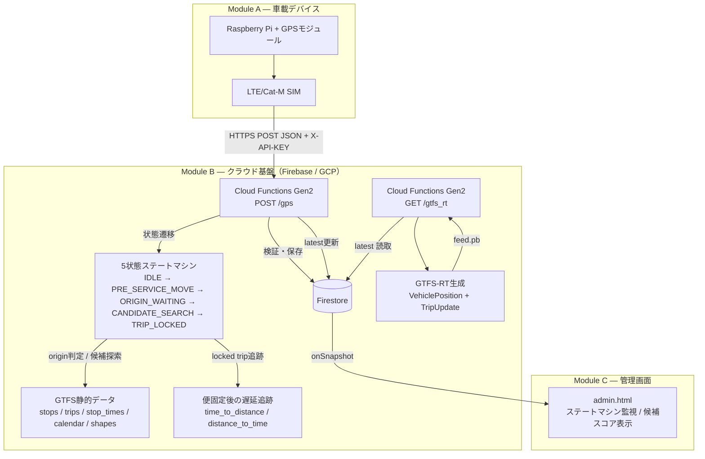
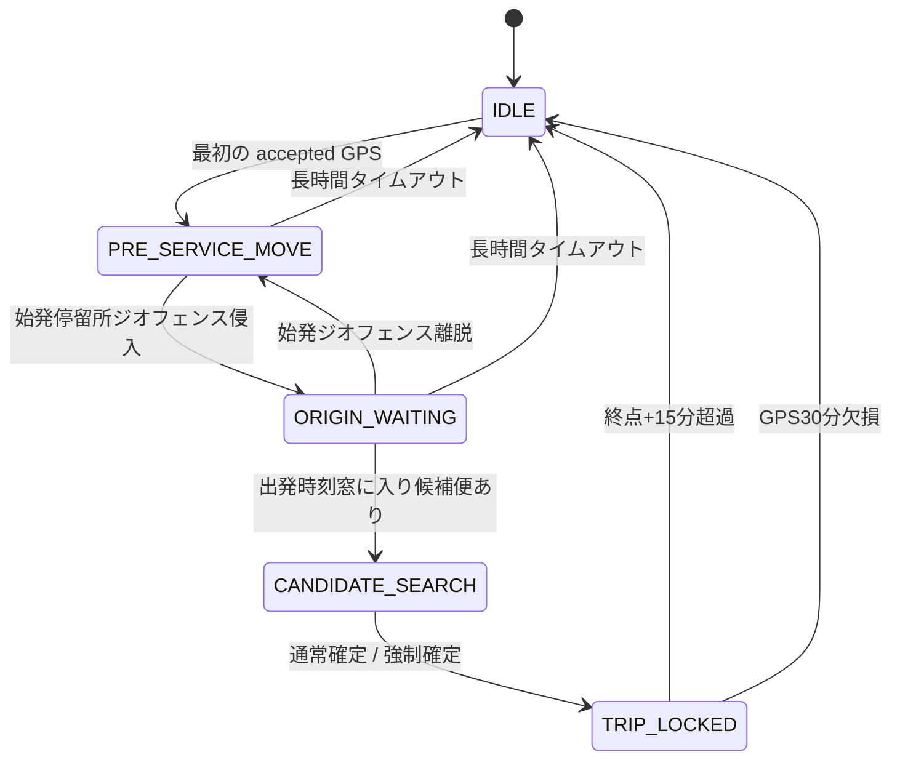

# 瑞穂町コミュニティバス バスロケーションシステム（PoC）
# アーキテクチャ設計書 v3

**Mizuho Bus Location PoC — Architecture Design Document (Trip Lock Model v3)**

| 項目 | 内容 |
|:---|:---|
| バージョン | 3.0 |
| 作成日 | 2026/04/30 |
| プロジェクト名 | Mizuho Bus Location PoC |
| 対象 | `main.py` / `admin.html` / Firestore / GTFS-RT |
| 設計方針 | 毎回再推定型から、候補絞り込み→便固定型へ移行 |

---

## 1. この設計変更の要点

### 1.1 変更前

従来方式では、GPS受信のたびにその時点の最適便を再推定していた。

```text
GPS受信 → 候補便抽出 → shape投影 → score計算 → 毎回 match_trip() → trip更新
```

この方式は実装が単純な一方で、以下の問題があった。

- 毎回再推定のため、**便が揺れる**
- 近接便がある時間帯で、**便の乗り移り（trip hopping）が起きる**
- `continuity_penalty` や `route_lock` は揺れを減らす補正であり、**根本解決ではない**
- GPSが車庫→駅の回送中でも送られるため、**営業便ではない移動が誤って便候補に混ざる**
- 乗客対応で出発よりかなり早く電源が入るため、**ACC ON 時刻をそのまま便探索起点にすると誤判定しやすい**

### 1.2 変更後

新方式では、車両の状態を明示的に持ち、**営業開始前の移動と営業便探索を分離**する。

```text
IDLE
  ↓ 最初の accepted GPS
PRE_SERVICE_MOVE
  ↓ 始発停留所ジオフェンスに入る
ORIGIN_WAITING
  ↓ 出発時刻窓に入る
CANDIDATE_SEARCH
  ↓ 候補比較で確定
TRIP_LOCKED
  ↓ 終点到達 or 長時間欠損
IDLE
```

一度 `TRIP_LOCKED` に入った後は、**便を変更せず、遅延だけ追跡**する。

---

## 2. 変更理由（簡潔版）

今回の変更理由は、技術的には「推定精度の改善」よりも、**運用安定性と説明可能性の改善**にある。

### 理由1: 毎回再推定は便揺れの原因になる
毎GPSで `match_trip()` を走らせる構造だと、少しのGPSブレや近接ダイヤで別便へ再解釈されうる。
そのため、利用者視点でも運行管理視点でも不安定に見える。

### 理由2: 回送GPSと営業GPSを分ける必要がある
今回の運用条件では、**車庫・置き場から駅までの移動中もGPSは送信される**。
これをそのまま営業便探索に使うと、営業開始前に誤って便候補へ紐づく。

### 理由3: ACC ON は営業開始を意味しない
出発より早く電源が入るため、ACC ON や最初のGPS受信をそのまま便探索開始条件にすると、早すぎる時点で候補判定が始まってしまう。
その結果、誤ロックの原因になる。

### 理由4: 時刻表上、同時刻帯の競合便は多くない
時刻表を確認すると、箱根ヶ崎駅東口・西口発の便は多いものの、**完全同時刻帯に大量の便が競合する構造ではない**。
したがって、「始発停留所に入ってから」「出発時刻窓に入ってから」候補探索を始めれば、少数候補の比較で十分に安定して便固定できる。

### 理由5: 便固定後は遅延追跡だけで十分
PoCの目的は毎回高度に再推定し続けることではなく、**安定してGTFS-RTを生成・公開できるか**の実証である。
一度便が確定した後は、遅延だけを追えば要件に十分合致する。

---

## 3. 変更点（簡潔版）

| 項目 | 旧方式 | 新方式 |
|---|---|---|
| 便決定 | 毎GPSで再推定 | 始発付近で候補絞込 → 一度確定したら固定 |
| 状態管理 | 実質ステートレス | `IDLE / PRE_SERVICE_MOVE / ORIGIN_WAITING / CANDIDATE_SEARCH / TRIP_LOCKED` |
| 回送中GPS | 便探索に混ざる | `PRE_SERVICE_MOVE` で吸収 |
| 早期ACC ON | そのまま候補探索に影響 | `ORIGIN_WAITING` で吸収 |
| 始発判定 | なし | origin stop のジオフェンスで判定 |
| 候補探索開始 | 現在時刻で全便候補 | 始発停留所 + 出発時刻窓で限定 |
| 安定化ロジック | continuity penalty / route lock | 不要。確定後は便変更しない |
| GPS平滑化 | 毎回 | `TRIP_LOCKED` 中のみ軽く適用 |
| GTFS-RT | latest に trip がなければ再推定 | 再推定しない。`TRIP_LOCKED` 時の trip のみ反映 |
| Firestore | trip中心 | `lock` オブジェクト中心 |
| admin画面 | route lock 可視化 | ステートマシンと候補スコアを可視化 |

---

## 4. システム全体構成



---

## 5. 状態遷移設計

### 5.1 状態一覧

| 状態 | 意味 | 便候補の扱い |
|---|---|---|
| `IDLE` | 運行外、またはリセット直後 | なし |
| `PRE_SERVICE_MOVE` | 車庫→駅など営業前移動 | 作らない |
| `ORIGIN_WAITING` | 始発停留所で待機中 | まだ作らない |
| `CANDIDATE_SEARCH` | 出発時刻窓に入り、候補便を比較中 | 作る |
| `TRIP_LOCKED` | 便確定後 | 変更しない |

### 5.2 状態遷移図



---

## 6. 各状態の処理詳細

### 6.1 IDLE

- まだ営業開始前
- 次の accepted GPS で `PRE_SERVICE_MOVE` に遷移
- `acc_on_at` を記録

### 6.2 PRE_SERVICE_MOVE

- 車庫や置き場から駅へ向かう回送を吸収する状態
- この状態では**便候補を作らない**
- GPSは記録するが、営業便探索には使わない
- いずれかの origin stop ジオフェンスへ入ったら `ORIGIN_WAITING`

### 6.3 ORIGIN_WAITING

- 箱根ヶ崎駅東口・西口など始発停留所での待機状態
- まだ便を確定しない
- `origin_stop_id` と `origin_zone_entered_at` を保持
- 出発時刻窓に入り、候補便が1件以上見つかったら `CANDIDATE_SEARCH`
- 始発ゾーンを離れたら `PRE_SERVICE_MOVE` へ戻る

### 6.4 CANDIDATE_SEARCH

- `find_departure_candidates(origin_stop_id, now_dt, service_ids)` で候補便を抽出
- 条件は以下

```text
service_id が当日に一致
AND trip の最初の stop_id が origin_stop_id に一致
AND 最初の departure_time が now ± 窓内
```

- 候補便ごとに shape投影し、以下を累積

```text
current_distance_m = project_to_shape(...)
expected_distance_m = time_to_distance(trip_id, now_sec)
distance_error_m = |current - expected|
累積スコア += distance_error_m
```

- 通常確定条件:
  - GPS受信回数 5回以上
  - 最良候補と次点の累積差 300m以上
  - 最良候補の平均誤差が 400m以下

- 強制確定条件:
  - GPS受信回数 15回以上
  - 最良候補を強制ロック

### 6.5 TRIP_LOCKED

- `locked_trip_id` を固定
- 以後は**便変更しない**
- shape投影と時刻補間で遅延だけ追跡

```text
current_distance_m = project_to_shape(shape, lat, lon)
expected_distance_m = time_to_distance(locked_trip_id, now_sec)
expected_time_sec   = distance_to_time(locked_trip_id, current_distance_m)
delay_sec           = now_sec - expected_time_sec
```

- `delay_sec > 0`: 遅延
- `delay_sec < 0`: 早着

- 位置平滑化はこの状態でのみ実施
- 逆行・ジャンプは reject するが、便自体は変更しない

---

## 7. 候補探索と始発停留所の考え方

### 7.1 origin stop の考え方

新設計では、始発停留所を文字列一致ではなく **`stop_id` で扱う**。
各 trip の最初の `stop_time` を見て、以下を構築する。

- `TRIP_ORIGIN_STOP_ID[trip_id]`
- `TRIP_ORIGIN_DEP_SEC[trip_id]`
- `ORIGIN_STOPS[stop_id]`

これにより、箱根ヶ崎駅東口 / 西口を含む複数の始発停留所を正確に扱える。

### 7.2 時刻表を踏まえた設計判断

時刻表を見ると、箱根ヶ崎駅発の便は多いが、完全同時刻に大量競合する構造ではない。
したがって、以下の設計が成立する。

- ACC ON ではなく、**始発停留所に入ってから探索開始**
- さらに **出発時刻窓に入ってから候補比較**
- その時点で候補便数は少数（多くても1〜2便程度）

この前提により、毎回再推定をせずとも、短時間で十分な精度で便固定できる。

---

## 8. GPS平滑化の扱い

| 状態 | 平滑化 |
|---|---|
| `PRE_SERVICE_MOVE` | なし |
| `ORIGIN_WAITING` | なし |
| `CANDIDATE_SEARCH` | なし（識別力優先） |
| `TRIP_LOCKED` | あり（軽いEMA） |

ロック前は、生GPSで候補識別を行う。ロック後のみ軽い平滑化を入れて見た目の安定性を高める。

---

## 9. Firestore設計

### 9.1 `vehicles/{vehicle_id}/state/latest`

最新の採用済みGPSと、現在の lock 状態を保持する。

| フィールド | 型 | 説明 |
|---|---|---|
| vehicle_id | string | 車両ID |
| lat / lon | number | 現在位置 |
| accuracy | number? | GPS精度 |
| speed | number? | 速度 |
| heading | number? | 方位 |
| timestamp | string | 端末時刻 |
| timestamp_unix | number | UNIX時刻 |
| server_received_at | string | 受信時刻 |
| updated_at | timestamp | Firestore更新時刻 |
| accepted | bool | 採用可否 |
| reject_reason | string? | 不採用理由 |
| trip | map? | `TRIP_LOCKED` 時の確定便情報 |
| lock | map | ステートマシン状態 |
| algorithm_version | string | アルゴリズム識別子 |

### 9.2 `lock` サブフィールド

| フィールド | 型 | 説明 |
|---|---|---|
| lock_state | string | `IDLE` / `PRE_SERVICE_MOVE` / `ORIGIN_WAITING` / `CANDIDATE_SEARCH` / `TRIP_LOCKED` |
| locked_trip_id | string? | 確定した便ID |
| candidate_trips | list | 候補便ID一覧 |
| candidate_scores | map | 候補便ごとの累積スコア |
| candidate_gps_count | number | 候補比較に使ったGPS回数 |
| lock_confirmed_at | number? | 確定時刻（unix） |
| lock_reason | string? | `normal_lock` / `forced_lock_close_race` 等 |
| acc_on_at | number? | 最初の accepted GPS時刻 |
| origin_stop_id | string? | 始発停留所ID |
| origin_zone_entered_at | number? | 始発ジオフェンス侵入時刻 |
| departure_window_opened_at | number? | 候補探索開始時刻 |
| last_accepted_at | number? | 最後の accepted GPS時刻 |

### 9.3 out-of-order 対応

古いGPSが後から届いた場合、`gps_logs` には保存するが、`latest` は更新しない。

```text
if observed_unix < latest.timestamp_unix:
    latest 更新をスキップ
```

これにより、古いイベントで状態が巻き戻る事故を防ぐ。

---

## 10. API設計

### 10.1 POST /gps

- GPSを受信
- 入力検証
- ステートマシンを進行
- Firestore保存
- `lock_state` を返す

#### 例: 候補探索中

```json
{
  "ok": true,
  "accepted": true,
  "lock_state": "CANDIDATE_SEARCH",
  "origin_stop_id": "hakonegasaki_east",
  "candidate_count": 2,
  "candidate_gps_count": 3,
  "locked_trip_id": null,
  "lock_reason": null
}
```

#### 例: 確定後

```json
{
  "ok": true,
  "accepted": true,
  "lock_state": "TRIP_LOCKED",
  "origin_stop_id": "hakonegasaki_east",
  "locked_trip_id": "3++平日+3",
  "lock_reason": "normal_lock",
  "trip": {
    "trip_id": "3++平日+3",
    "delay_min": 2.5,
    "nearest_stop": "瑞穂町役場"
  }
}
```

### 10.2 GET /gtfs_rt

- Firestore `latest` を読む
- **再推定はしない**
- `lock.lock_state == TRIP_LOCKED` のときのみ trip / TripUpdate を生成
- それ以外は位置だけの VehiclePosition とする

---

## 11. 管理画面（admin.html）

新しい管理画面では、route lock ではなく **ステートマシン中心**に監視する。

### 主な表示要素

- 現在の `lock_state`
- 状態パイプライン可視化
- `origin_stop_id`
- `locked_trip_id`
- `lock_reason`
- `candidate_scores` テーブル
- `TRIP_LOCKED` 時の遅延・最寄停留所・進捗バー
- GTFS-RT feed状態
- GPSログ一覧

### 管理画面の目的

- いま車両が「回送中」なのか「始発待機」なのか「候補探索中」なのかを一目で分かるようにする
- 誤ロック時に、候補スコアの差を見て原因分析しやすくする
- 旧 route lock より、運用者へ説明しやすい監視UIにする

---

## 12. 旧方式との差分（実装観点）

| 項目 | 旧 `main.py` | 新 `main.py` |
|---|---|---|
| 中心関数 | `match_trip()` | `advance_state()` |
| 候補抽出 | 現在時刻で全便候補 | origin stop + 出発時刻窓 |
| 安定化 | `SAME_TRIP_BONUS` / `ROUTE_LOCK_BONUS` 等 | 不要 |
| route lock | あり | 廃止 |
| smoothing | 毎回 | `TRIP_LOCKED` 時のみ |
| GTFS-RT fallback | latest に trip が無ければ再推定 | 廃止 |
| 最新状態 | trip中心 | lock中心 |
| UI | route lock表示 | state machine表示 |

---

## 13. 受け入れ基準

本変更の受け入れは、以下の観点で判定する。

| 指標 | 目標 |
|---|---|
| 1運行中の trip_id 変更回数 | 原則 0回 |
| CANDIDATE_SEARCH → TRIP_LOCKED まで | 60秒以内を基本、150秒以内で強制確定 |
| TRIP_LOCKED 後の平均 distance_error | 旧方式以下 |
| GTFS-RT の trip 揺れ | 0件 |
| 回送中に営業便へ誤ロック | 原則 0件 |
| 出発前早期電源ON時の誤ロック | 原則 0件 |

---

## 14. まとめ

今回の変更は、単なるマッチングロジック改善ではなく、**「毎回その瞬間の最良便を当てるシステム」から「営業開始を見極めて、一度便を固定し、以後は追跡するシステム」への設計転換**である。

この設計により、

- 回送GPSを営業便探索から切り離せる
- 早すぎるACC ONの影響を吸収できる
- 便揺れ・便飛びを構造的に防げる
- PoCとして説明可能性の高い運用ができる

という効果が得られる。
