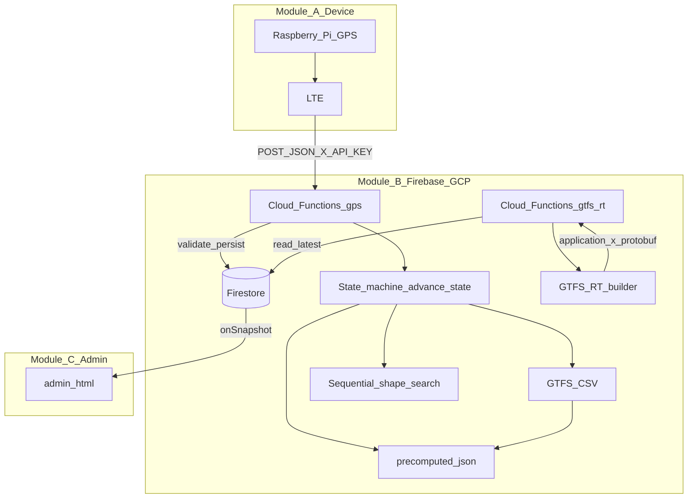
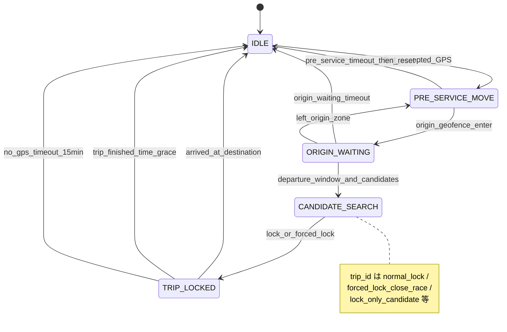

# 瑞穂町コミュニティバス バスロケーションシステム（PoC）

# アーキテクチャ設計書（`main.py` 同期版）

**Mizuho Bus Location PoC — Architecture (Trip Lock v3.3, aligned with backend `main.py`)**

| 項目 | 内容 |
|:---|:---|
| 文書バージョン | 3.3-sync |
| 基準日 | 2026/05/12 |
| プロジェクト名 | Mizuho Bus Location PoC |
| 対象実装 | [backend/main.py](../backend/main.py)（`ALGORITHM_VERSION` 準拠） |
| 関連UI | [frontend/admin.html](../frontend/admin.html) |
| 設計方針 | 候補絞り込み→便固定、固定後は遅延追跡のみ。GTFS-RT は再推定しない |

---

## 1. 概要

クラウド側モジュール（`main.py` モジュール docstring に準拠）は次を担う。

- GPS 受信（HTTPS）
- 5 状態のステートマシン（回送と営業探索の分離、便固定）
- 固定後の遅延・進捗追跡（shape 投影、シーケンシャル探索によるガード、始発保留）
- GTFS-RT（protobuf）生成
- Firestore への永続化・監査

**アルゴリズム識別子**（イベントや `latest` に記録）:

- `ALGORITHM_VERSION = "trip-lock-state-machine-v3.3-end-arrival"`

**設計上の不変条件**:

1. 一度 `TRIP_LOCKED` した便は原則変更しない。
2. 位置の平滑化は `TRIP_LOCKED` 中のみ。
3. `GET /gtfs_rt` は Firestore `latest` を読むだけで、便を再推定しない。

---

## 2. 変更前後の要点（architecture.md との連続性）

### 2.1 旧方式の問題

GPS ごとに最適便を取り直す方式は、便の揺れ・近接ダイヤでの乗り移り、回送 GPS の混入、早い電源投入による誤探索を招きやすい。

### 2.2 現方式

明示的な状態で「営業前」「始発待ち」「候補比較」「固定運行」を分離する。

```text
IDLE
  ↓ 最初の accepted GPS
PRE_SERVICE_MOVE
  ↓ 始発停留所ジオフェンス侵入
ORIGIN_WAITING
  ↓ 出発時刻窓に入り候補便あり
CANDIDATE_SEARCH
  ↓ 確定 / 強制確定
TRIP_LOCKED
  ↓ 終了判定（到着即時・時刻猶予・GPS欠損・タイムアウト）
IDLE
```

固定後は **遅延と進捗**のみ更新し、GTFS-RT はその確定状態を反映する。

---

## 3. システム全体構成



- **静的データ**: `data/gtfs/*.txt` に加え、起動時に `data/gtfs/precomputed.json` を読み込む（shape の点列と累積距離、`trip_progress`、`stop_to_shape_dist`、`TRIP_SHAPE_START_ABS` 等）。`PRECOMPUTED_VERSION` は GTFS ディレクトリ内当該ファイルの SHA1 短縮ログ用。
- **Firebase**: Cloud Functions Gen2 `@https_fn.on_request()` で `gps` / `gtfs_rt` の2エントリ。

---

## 4. データソースと主なメモリ構造

| 読込元 | 用途 |
|:---|:---|
| `stops.txt` | 停留所座標・名称 |
| `routes.txt` / `trips.txt` | 路線・便・shape_id・service_id |
| `stop_times.txt` | 時刻・`stop_sequence`（ソート済み配列として保持） |
| `calendar.txt` / `calendar_dates.txt` | 稼働 service 判定 |
| `precomputed.json` | shape 点列と距離、`TRIP_PROGRESS`、`STOP_TO_SHAPE_DIST`、便ごとの shape 上原点オフセット等 |

コード内の代表グローバル（初期化は `_do_init` / スレッドセーフな `_ensure_init`）:

- `TRIP_ORIGIN_STOP_ID` / `TRIP_ORIGIN_DEP_SEC` / `ORIGIN_STOPS` — 始発特定
- `SHAPES` / `SHAPE_TOTAL_DISTANCE` / `TRIP_SHAPE_START_ABS` / `TRIP_ROUTE_LENGTH` — 投影・距離
- `TRIP_PROGRESS` — 時刻↔距離補間、終点判定
- `STOP_TO_SHAPE_DIST` — TripUpdate 生成時の通過済み停留所の除外

---

## 5. 状態一覧と遷移

### 5.1 状態一覧

| 状態 | 意味 | 便候補 |
|:---|:---|:---|
| `IDLE` | 運行外またはリセット直後 | なし |
| `PRE_SERVICE_MOVE` | 車庫→始発など回送 | 作らない |
| `ORIGIN_WAITING` | 始発ジオフェンス内待機 | まだ作らない（窓突入まで） |
| `CANDIDATE_SEARCH` | 出発時刻窓内でスコア累積 | 作る・更新する |
| `TRIP_LOCKED` | 便確定 | 固定 |

### 5.2 状態遷移図（実装準拠）



補足:

- **accepted でない GPS** は `advance_state` を進めない（ログ・`trip_match` なしで永続化）。
- **`last_accepted_at` から `NO_GPS_IDLE_SEC`（15 分）超**で、`no_gps_timeout` により `IDLE` に戻す（以降の処理はスキップして即 return）。
- **`PRE_SERVICE_MAX_SEC`（4 時間）超**は `_reset_to_idle("pre_service_timeout")` のあと、実装上すぐ `PRE_SERVICE_MOVE` に戻し `acc_on_at` を更新する（長時間回送の Watchdog）。
- **`ORIGIN_WAITING_MAX_SEC`（3 時間）超**は `origin_waiting_timeout` で `IDLE`。
- **`CANDIDATE_SEARCH`** では毎 GPS **`find_departure_candidates` を再実行**し、時刻窓外に落ちた便はスコア対象から外す。スコアは窓内に残った `trip_id` のみ引き継ぐ。

---

## 6. コア処理フロー（関数レベル）

### 6.1 HTTP `gps`

1. `_ensure_init()` — Firebase・GTFS・precomputed 読込
2. `OPTIONS` / `POST` 以外・API キー（環境変数 `API_KEY` があれば `X-API-KEY` 必須）
3. JSON パース、`observed_dt` は `_parse_payload_timestamp`（無ければ現在 JST）
4. `_validate_gps` — 緯度経度・サービスエリア・精度（`accuracy > 100` は却下）
5. `vehicles/{vehicle_id}/state/latest` を読み `prev_state`（既定 `vehicle_id` は定数 `VEHICLE_ID`、ボディで上書き可）
6. **`advance_state(prev_state, lat, lon, observed_dt, accepted, accuracy)`**
7. **`_persist_observation`** — バッチ書き込み（後述）
8. JSON 応答（`lock_state`、`skipped_latest_update`、`event_id`、条件付き `trip`）

### 6.2 `advance_state` の内部

- `load_lock_state` — `prev_state.lock` を `DEFAULT_LOCK` にマージ。移行互換で `TRIP_LOCKED` かつ `locked_trip_id` 欠落時は旧 `trip.trip_id` から復元。
- 状態ごとの遷移（本節 5）。
- **`CANDIDATE_SEARCH`**:`update_candidate_scores` → `decide_trip_lock`
  - `evaluate_candidate_once` は **`resolve_search_window(trip_id, first_seq)`** で始発付近の shape 区間に限定して投影（往復 shape の誤スナップ抑制）。
  - 投影横ずれ `offset_m > MAX_SHAPE_OFFSET_M` は無効扱い（スコアに大ペナルティ）。
- **`TRIP_LOCKED`**:
  - `smooth_locked_position`（EMA, `SMOOTH_ALPHA`）
  - `track_locked_trip` — `resolve_search_window(trip_id, cur_seq)` と `prev_distance_m` アンカーで `_project_to_trip_distance`
  - `lock["locked_trip_progress"]` を `lock_progress_next` で更新
  - `_is_trip_finished` が真なら `_reset_to_idle(reason)`、`trip_match` は無効化

### 6.3 shape 投影とシーケンシャル窓

- `project_to_shape(shape_id, lat, lon, dist_min, dist_max)` — セグメント走査。`dist_min`/`dist_max` により **shape 絶対累積距離の帯**に限定。
- `resolve_search_window` — 現在 `stop_sequence` から最大 `SEARCH_LOOKAHEAD_STOPS` 先まで見た距離帯＋`SEARCH_LOOKBEHIND_M` / `SEARCH_LOOKAHEAD_BUFFER_M` で `[dist_min_rel, dist_max_rel]`（便起点相対）を構築。
- `_project_to_trip_distance` — 上記を `TRIP_SHAPE_START_ABS` で shape 絶対距離に変換。帯外なら全体探索にフォールバック。アンカーがある場合は複数候補から最も近い **非負の便起点距離**を選択。

### 6.4 候補確定 `decide_trip_lock`

優先度ソート後の `scores` と `gps_count` から:

| 条件 | 結果 |
|:---|:---|
| `gps_count < CANDIDATE_MIN_GPS_COUNT` | 未確定 |
| 1 位平均誤差 `> CANDIDATE_MAX_AVG_ERROR_M` かつ `gps_count < CANDIDATE_FORCE_GPS_COUNT` | 未確定 |
| 上記で平均誤差超かつ強制回数到達 | `forced_lock_low_quality` |
| 候補1件のみ | `lock_only_candidate`（回数条件後） |
| 1位・2位スコア差 `≥ CANDIDATE_LOCK_GAP_M` | `normal_lock` |
| 差が不足だが `gps_count ≥ CANDIDATE_FORCE_GPS_COUNT` | `forced_lock_close_race` |

### 6.5 ロック中追跡 `track_locked_trip`

- **逆行・ジャンプ**: `delta_from_prev_m` がしきい値を超えたら `rejected_motion` を設定。逆行時は距離を `max(投影, prev)` で下げない（シーケンスは戻さない）。
- **通過シーケンス** `update_passed_sequence` — 次停留所の shape 距離を `STOP_PASS_THRESHOLD_M` で見て前進。
- **始発保留 `holding_at_origin`**: まだ日中の `now_sec < sched_dep_sec` かつ距離・シーケンスが始発相当なら、**期待距離0・遅延0**（早着表出し抑止）。しきい値は `ORIGIN_HOLD_RELEASE_DISTANCE_M`。
- **最寄停留所** `_nearest_progress_stop` + `STOP_NEAR_GEO_THRESHOLD_M` で `vehicle_stop_status` を `STOPPED_AT` に寄せる場合あり。

### 6.6 終了判定 `_is_trip_finished`

`TRIP_PROGRESS` 終端から終了時刻・終端距離・終端 `stop_sequence` を取得。

1. **`now_sec > end_time_sec + LOCKED_END_GRACE_SEC`** → `trip_finished`
2. **`now_sec ≥ end_time_sec - END_ARRIVAL_EARLY_WINDOW_SEC`** かつ（終端 `stop_sequence` に到達 **または** 終端距離との差 `≤ END_STOP_DISTANCE_THRESHOLD_M`）→ `arrived_at_destination`

---

## 7. 主要パラメータ一覧（`main.py` 定数）

| 定数 | 値（概略） | 意味 |
|:---|:---|:---|
| `ORIGIN_GEOFENCE_RADIUS_M` | 120 | 始発ジオフェンス半径 |
| `ORIGIN_LEAVE_HYSTERESIS_M` | 60 | 離脱判定のヒステリシス |
| `DEPARTURE_WINDOW_OPEN_SEC` | 900 | 始発予定の何秒前から窓入りか |
| `DEPARTURE_WINDOW_CLOSE_SEC` | 600 | 始発予定の何秒まで窓継続か |
| `CANDIDATE_MIN_GPS_COUNT` | 5 | 通常確定に必要な最小 GPS 回数 |
| `CANDIDATE_FORCE_GPS_COUNT` | 15 | 強制確定の GPS 回数 |
| `CANDIDATE_LOCK_GAP_M` | 300 | 1位・2位の累積スコア差 |
| `CANDIDATE_MAX_AVG_ERROR_M` | 400 | 1位平均距離誤差上限 |
| `MAX_SHAPE_OFFSET_M` | 250 | 候補評価で棄却する横ずれ |
| `SMOOTH_ALPHA` | 0.6 | ロック中 EMA（現在:過去） |
| `LOCKED_REVERSE_REJECT_M` | 200 | 逆行とみなす閾値 |
| `LOCKED_JUMP_REJECT_M` | 1500 | ジャンプとみなす閾値 |
| `SEARCH_LOOKBEHIND_M` / `SEARCH_LOOKAHEAD_STOPS` / `SEARCH_LOOKAHEAD_BUFFER_M` | 100 / 2 / 500 | シーケンシャル探索帯 |
| `STOP_PASS_THRESHOLD_M` | 30 | 停留所通過の距離マージン |
| `ORIGIN_HOLD_RELEASE_DISTANCE_M` | 50 | 始発保留解除距離 |
| `LOCKED_END_GRACE_SEC` | 900 | 終着予定+猶予でタイムアウト |
| `END_STOP_DISTANCE_THRESHOLD_M` | 100 | 終点到着とみなす距離差 |
| `END_ARRIVAL_EARLY_WINDOW_SEC` | 300 | 終着何秒前から即終了判定を許すか |
| `NO_GPS_IDLE_SEC` | 900 | accepted GPS 欠損で IDLE |
| `PRE_SERVICE_MAX_SEC` | 14400 | 回送状態タイムアウト |
| `ORIGIN_WAITING_MAX_SEC` | 10800 | 始発待機タイムアウト |
| `STOP_NEAR_GEO_THRESHOLD_M` | 70 | 停留所の近接判定 |
| `EVENT_RETENTION_DAYS` | 400 | `expire_at` 算出 |
| `CANDIDATE_STORE_LIMIT` | 8 | Firestore に残す候補詳細の上限 |
| `ENABLE_GTFS_RT_AUDIT` | True | GTFS-RT 監査書き込み |

サービスエリアは `LAT_MIN/MAX`, `LON_MIN/MAX` で矩形クリップ。

---

## 8. Firestore 設計

### 8.1 `vehicles/{vehicle_id}/state/latest`

最新 accepted 系メタ（`trip` / `lock` は `_thin_trip` / `_thin_lock` でフィールド制限）。`algorithm_version` を保持。

### 8.2 `lock`（`DEFAULT_LOCK` ベース）

| フィールド | 説明 |
|:---|:---|
| `lock_state` | 5 状態 |
| `locked_trip_id` | 確定便 |
| `candidate_trips` / `candidate_scores` / `candidate_gps_count` | 探索中 |
| `lock_confirmed_at` / `lock_reason` | 確定時刻・理由文字列 |
| `acc_on_at` / `origin_stop_id` / `origin_zone_entered_at` / `departure_window_opened_at` / `last_accepted_at` | タイムライン |
| **`locked_trip_progress`** | `current_stop_sequence`, `max_passed_stop_sequence`, `last_distance_m`, `last_updated_at`, `holding_at_origin` 等 |

### 8.3 その他コレクション

| パス | 内容 |
|:---|:---|
| `gps_logs/{event_id}` | 生ログ互換・全イベント |
| `vehicles/{vehicle_id}/events/{event_id}` | 詳細イベント（`lock_debug`, `system.thresholds`, `precomputed_version`） |
| `vehicles/{vehicle_id}/events/{event_id}/candidates/{id}` | スコア上位 `CANDIDATE_STORE_LIMIT` 件 |
| `vehicles/{vehicle_id}/gtfs_rt_audit/{snapshot_id}` | GTFS-RT バイト列の base64・メタ（`ENABLE_GTFS_RT_AUDIT`） |

### 8.4 out-of-order 防止

`accepted` かつ `timestamp_unix < prev_state.timestamp_unix` のとき **`latest` を更新しない**（`skipped_latest_update` が true）。古い GPS で状態が巻き戻るのを防ぐ。

---

## 9. API 設計

### 9.1 POST `gps`（Cloud Function `gps`）

- ヘッダ: `Content-Type: application/json`, 任意 `X-API-KEY`
- ボディ例フィールド: `lat`, `lon`, `timestamp`（ISO）, `accuracy`, `vehicle_id`, …

**応答（例・探索中）**

```json
{
  "ok": true,
  "accepted": true,
  "lock_state": "CANDIDATE_SEARCH",
  "origin_stop_id": "hakonegasaki_east",
  "candidate_count": 2,
  "candidate_gps_count": 3,
  "locked_trip_id": null,
  "lock_reason": null,
  "skipped_latest_update": false,
  "event_id": "..."
}
```

**応答（例・固定後）**

```json
{
  "ok": true,
  "accepted": true,
  "lock_state": "TRIP_LOCKED",
  "origin_stop_id": "hakonegasaki_east",
  "candidate_count": 0,
  "candidate_gps_count": 7,
  "locked_trip_id": "3++平日+3",
  "lock_reason": "normal_lock",
  "skipped_latest_update": false,
  "event_id": "...",
  "trip": {
    "trip_id": "3++平日+3",
    "route_id": "...",
    "route_name": "...",
    "nearest_stop": "...",
    "status": "IN_TRANSIT_TO",
    "current_distance_m": 1234.5,
    "expected_distance_m": 1200.0,
    "distance_error_m": 34.5,
    "offset_m": 12.3,
    "delay_sec": 120,
    "delay_min": 2.0,
    "current_stop_sequence": 5,
    "max_passed_stop_sequence": 4,
    "holding_at_origin": false,
    "rejected_motion": null
  }
}
```

### 9.2 GET `gtfs_rt`（Cloud Function `gtfs_rt`）

- `vehicles/{VEHICLE_ID}/state/latest` を読む（**クエリで vehicle を切り替えない実装**）。
- `lock.lock_state == "TRIP_LOCKED"` のときのみ `state.trip` を TripUpdate 生成に利用。それ以外は VehiclePosition のみに近い形（便紐付けなし）。
- 応答後 `_persist_gtfs_rt_audit` を実行（フラグオン時）。

### 9.3 GTFS-RT 内容

- `build_gtfs_rt_feed` — `FeedMessage`、VehiclePosition は常時。便ありなら `VehiclePosition.trip` と `TripUpdate`（`build_stop_time_updates`）。
- **StopTimeUpdate**: `holding_at_origin` 中は遅延を 0 に固定。通過済み停留所は **shape 距離**（`current_distance_m - 30` より手前）および **`current_stop_sequence` 未満**で除外。

---

## 10. 管理画面（admin.html）

[frontend/admin.html](../frontend/admin.html) は、route lock ではなく **ステートマシンと候補スコア**を中心に監視する想定である。

- `lock_state`, `origin_stop_id`, `locked_trip_id`, `lock_reason`
- `candidate_scores` / `candidate_gps_count`
- `TRIP_LOCKED` 時の遅延・進捗・最寄停留所
- `locked_trip_progress` が存在する場合は、シーケンス進行と始発保留の確認に利用できる

（本書は UI の項目をコードと1対1で固定しない。）

---

## 11. 受け入れ基準（運用観点）

| 指標 | 目安 |
|:---|:---|
| 1 運行中の `trip_id` 変更 | 原則 0 |
| `CANDIDATE_SEARCH` → `TRIP_LOCKED` | 通常は短時間、`CANDIDATE_FORCE_GPS_COUNT` で上限 |
| `TRIP_LOCKED` 後の GTFS-RT の便揺れ | 0（再推定しないため） |
| 回送・早出発電源の誤ロック | 設計上 `PRE_SERVICE_MOVE` / `ORIGIN_WAITING` / 窓で抑制 |

---

## 12. まとめ

本実装は、「毎受信で最良便を当て直す」モデルから、**営業開始を始発ジオフェンスと出発窓で区切り、少数候補をスコアして一度固定し、その後はシーケンシャルに shape 上を追う**モデルへ移行したものである。v3.3 では **終点到着の即時アイドル復帰**と **始発保留**、**往復 shape 対策**、**precomputed 依存**が `main.py` に明示的に表れている。

同期版ドキュメントとして、数値・パス・関数責務は [backend/main.py](../backend/main.py) を正とする。
