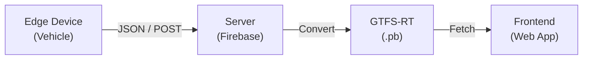

# 瑞穂町コミュニティバス ロケーションシステム 要件定義書

| 項目 | 内容 |
|:---|:---|
| **プロジェクト名** | Mizuho Bus Location PoC (瑞穂町バスロケ実証実験) |
| **バージョン** | 1.1 (Rev.2) |
| **作成日** | 2026/02/01 |
| **ドキュメント管理** | docs/requirements_v1.1.md |

---

## 1. プロジェクト概要

### 1.1 目的
瑞穂町コミュニティバスにおける「バス待ちの不安（5分の壁）」を解消するため、位置情報をリアルタイムに可視化する。  
本プロジェクトは **2026年3月31日までの実証実験 (PoC)** と位置づけ、以下の2点を技術検証のゴールとする。

1. **完全自動運用**  
   運転手の操作負担をゼロにする（自動起動、自動判定）。

2. **標準化対応**  
   出力データを世界標準規格「GTFS-Realtime」に準拠させ、将来的な拡張性を担保する。

---

### 1.2 システム全体構成 (Architecture)



---

## 2. モジュール詳細要件

### Module A: エッジデバイス (Edge)

* **担当:** 関  
* **概要:** 車両の位置情報を定期的に送信する端末。

| ID | 項目 | 詳細仕様 | 優先度 |
|:--|:--|:--|:--|
| **A-01** | **ハードウェア** | **汎用エッジデバイス**を採用する。<br><br>※PoC段階ではAndroid端末、または専用IoTモジュールを使用。 | 高 |
| **A-02** | **計測データ** | GPS（緯度・経度）、タイムスタンプ、精度、（可能なら）方位・速度。 | 高 |
| **A-03** | **通信仕様** | **30秒間隔（推奨）**でサーバーへHTTPS POST送信を行う。 | 高 |
| **A-04** | **自動化** | 車両電源（ACC/IG）と連動し、給電開始で計測開始、給電停止で終了／スリープすること。 | 高 |
| **A-05** | **冗長性** | 通信圏外時は再接続を試行し、復帰時に自動再開すること。 | 中 |

---

### Module B: サーバーサイド (Server)

* **担当:** 戸谷  
* **概要:** 位置情報の受信、運行判定、GTFS-RT生成を行うバックエンド。

| ID | 項目 | 詳細仕様 | 優先度 |
|:--|:--|:--|:--|
| **B-01** | **データ受信** | Firebase Realtime Database にてJSONデータを受け付ける。 | 高 |
| **B-02** | **運行判定** | **(Core Logic)** 受信したGPS座標とGTFS-JP（静的ダイヤ）を照合し、現在運行中の `trip_id` を自動推定する。 | 高 |
| **B-03** | **遅延計算** | 推定されたダイヤの通過予定時刻と現在時刻を比較し、遅延（delay）を算出する。 | 高 |
| **B-04** | **GTFS-RT生成** | 判定結果を Protocol Buffers 形式（`feed.pb`）にシリアライズする。 | 高 |
| **B-05** | **公開API** | 生成した `.pb` ファイルを静的URLとして公開する（Hosting利用）。 | 高 |
| **B-06** | **GTFS-RTログ** | 生成したGTFS-RT（feed.pb 相当の内容）のログを保存する。実証実験終了時にデータとしてまとめられるようにする。 | 中 |

---

### Module C: フロントエンド (Frontend)

* **担当:** 戸谷  
* **概要:** 利用者向けにバス位置を表示するWebアプリケーション。

| ID | 項目 | 詳細仕様 | 優先度 |
|:--|:--|:--|:--|
| **C-01** | **データ取得** | サーバーが公開する `feed.pb` を定期的にFetchし、`protobufjs` でデコードする。 | 高 |
| **C-02** | **地図表現** | 地理的な正確さよりも視認性を重視した **デフォルメ地図（トポロジーマップ）** を採用する。 | 高 |
| **C-03** | **位置表示** | 緯度経度を直接プロットせず、「区間進捗率」に基づきアイコンを配置する。 | 高 |
| **C-04** | **状態可視化** | 遅延状況を色で表現（例：緑＝定刻、赤＝遅延）。 | 高 |

---

## 3. インターフェース定義 (Data Schema)

### 3.1 Edge → Server（JSON）

Android / IoTデバイスから送信されるペイロード。

```json
POST /update_location
{
  "device_id": "bus_001",
  "lat": 35.771234,
  "lon": 139.345678,
  "timestamp": 1706755200,
  "accuracy": 12.5,
  "bearing": 120.0,
  "speed": 30.5
}
```

---

### 3.2 Server Output（GTFS-Realtime）

Protocol Buffers（v2.0）形式。

**含まれるEntity**
- `VehiclePosition`
- `TripUpdate`

**TripUpdate**
- `trip_id` : 自動判定された運行ID  
- `delay` : 遅延秒数（例：300 = 5分）

**VehiclePosition**
- `position` : 緯度・経度  
- `vehicle_id` : デバイスIDとのマッピング結果

---

## 4. 運用・ログ

実証実験（2026年3月31日まで）終了後に結果を分析できるよう、以下を運用方針とする。

* **GTFS-RT ログの保存**  
  Module B で生成した GTFS-RT（trip_id・遅延・位置など）の内容を、時系列でログとして保存する。保存先・形式（Realtime Database、Cloud Storage、BigQuery 等）は実装時に決定する。実証実験終了時に一括でデータをまとめられるようにする。

---


## ゴール変更（2026-02 更新）
本PoCの主目的は、住民向け完成UIの提供ではなく、
「1台のバス車両において、清瀬モデル相当
（GPS取得→GTFS-Realtime生成→公開）を
Google品質要件を満たす形で、いくらの費用で実現できるか」
を実証し、行政向けの比較・検討資料を作成することである。

## 対象範囲
- PoCはバス1台のみ
- Module A（車載）と Module B（サーバ）を主対象とする
- Module C（表示UI）は必須としない

## 更新頻度
- 通常運用：10秒間隔
- 通信劣化時でも最大30秒以内を維持する設計とする

